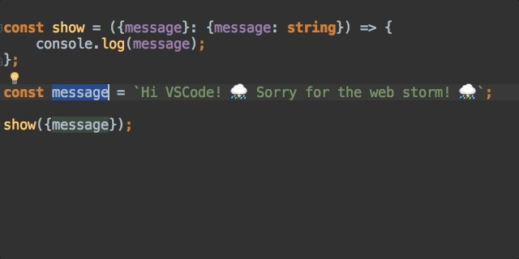

# Object Literal Property Value Shorthand

It is common to create JavaScript objects using some local variables with the same names as the object properties ending up with something redundant like this: 

```javascript
const firstName = 'Foo';
const lastName = 'BAR';
​
const user = {
    firstName: firstName,
    lastName: lastName,
    email: 'foo.bar@wishtack.com'
};
```

... but thanks to the Object Literal Property Value Shorthand, it can be written in a shorter manner:

```javascript
const firstName = 'Foo';
const lastName = 'BAR';
​
const user = {
    firstName,
    lastName,
    email: 'foo.bar@wishtack.com'
};
```


You should define your style guide concerning this syntax.

If the JavaScript ecosystem is quite new for the team, it is better to avoid this syntax which can be misleading.



Beware of IDEs that can't refactor Object Literal Property Value Shortands.

At Wishtack, we didn't use them until the refactoring was possible with IntelliJ / WebStorm.





